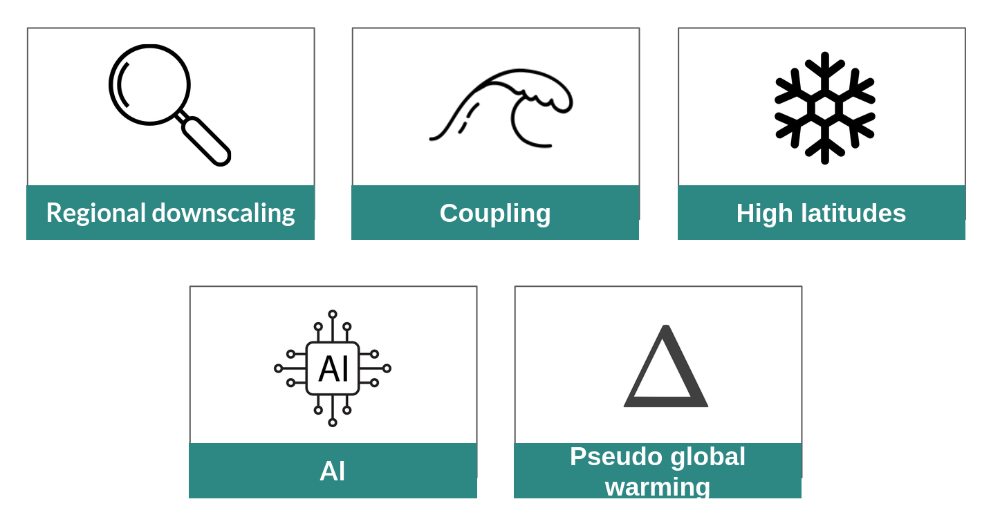

The **HARMONIE-Climate (HCLIM)** is a regional climate model framework developed jointly by several European national meteorological services. It is the *climate* version of the HIRLAM–ALADIN Research on Mesoscale Operational numerical weather prediction (NWP) in Euromed (HARMONIE) system, with HCLIM development closely linked to HARMONIE advancements.  

## Latest news





### [{{ news.title }}]({{ news.url | relative_url }})

<small>{{ news.date | date: "%d %B %Y" }}</small>

{{ news.content | strip_html | strip_newlines | truncatewords: 25 }}

[Read more →]({{ news.url | relative_url }})



[See all news →]({{ "/news/" | relative_url }})

## Research areas

## Key references

- HCLIM43 description paper: Wang, F. (2024). An introduction to the HARMONIE-Climate (HCLIM) regional climate modeling system. Zenodo. <https://doi.org/10.5281/zenodo.11424181>

- HCLIM38 description paper: Belušić, D., de Vries, H., Dobler, A., Landgren, O., Lind, P., Lindstedt, D., Pedersen, R. A., Sánchez-Perrino, J. C., Toivonen, E., van Ulft, B., Wang, F., Andrae, U., Batrak, Y., Kjellström, E., Lenderink, G., Nikulin, G., Pietikäinen, J.-P., Rodríguez-Camino, E., Samuelsson, P., van Meijgaard, E., and Wu, M., 2020: HCLIM38: a flexible regional climate model applicable for different climate zones from coarse to convection-permitting scales. Geosci. Model Dev., 13, 1311–1333. <https://doi.org/10.5194/gmd-13-1311-2020>
